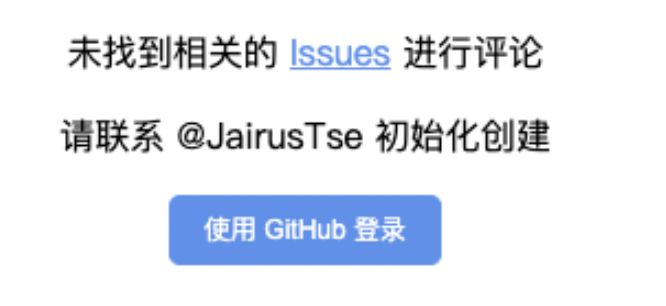

### 1.  注册 GitHub Application

[https://github.com/settings/applications/new](https://github.com/settings/applications/new)

### 2. 配置  `_config.yml`

在 comments 那添加

```html
  gitalk: true
  gitalk_clientID: 'Client ID'
  gitalk_Secret: 'Client Secret'
  gitalk_repo: '用户名.github.io'
  gitalk_owner: '用户名'
  gitalk_admin: '用户名'
  distractionFreeMode: true
```

### 配置  `post.html`

类似于下面的代码

```html
<link rel="stylesheet" href="https://cdn.jsdelivr.net/npm/gitalk@1/dist/gitalk.css">

<script src="https://cdnjs.cloudflare.com/ajax/libs/blueimp-md5/2.16.0/js/md5.min.js"></script>

<script src="https://cdn.jsdelivr.net/npm/gitalk@1/dist/gitalk.min.js"></script>

<script type="text/javascript">
    var gitalk = new Gitalk({

        clientID: '{{site.gitalk.clientID}}',

        clientSecret: '{{site.gitalk.clientSecret}}',

        repo: '{{site.gitalk.repo}}',

        owner: '{{site.gitalk.owner}}',

        admin: ['{{site.gitalk.admin}}'],

        // distractionFreeMode: {{ site.gitalk.distractionFreeMode }},

        id: md5(location.pathname),

        proxy: 'https://cors-anywhere.1l1.icu/https://github.com/login/oauth/access_token'

    });

    gitalk.render('gitalk-container');
```

### 4. 遇到的问题



遇到上面的问题 点击 `Issues` 查询不到评论信息
点击底下的使用 `使用Github登录` 一直转圈，一直以为是 `repo`  仓库配置的有问题，检查了很多次都没有错
后来以为gitalk的生成的评论是使用的链接的中文名可能不支持，后来改成md5生成也不行
然后翻了一下 [gitalk](https://github.com/gitalk/gitalk/issues?q=is%3Aissue%20state%3Aclosed%20access) 的Issues 才知道是自己的access_token 被qiang了
翻帖子发现可以在GitTalk里面加一下 `proxy` 字段 开代理
找了很多个评论的可用的proxy发现都失效了
最后找到一个可用的 简单解决了 
引用里面也有教程说可以自己搭建proxy

简单说一下自己的看法，
* 使用别人的代理可能不稳定，说不定什么时候就禁了
* gitalk 上次提交是2021年了，不知道是不是有些旧了，也可以尝试换一下其他方法做评论了
* 看有评论说可以使用`utterances`简单方便，下次proxy 不可用了可以试一下

### 引用

* [https://proxy-gitalk-api.netlify.app/](https://proxy-gitalk-api.netlify.app/)  
* [https://github.com/serverless-coding/cors-server](https://github.com/serverless-coding/cors-server)  
* [https://github.com/kurisaW/cros-server](https://github.com/kurisaW/cros-server)
* [修改Gitalk代理地址，解决无法登录问题](https://apidocs.cn/blog/front/js/%E4%BF%AE%E6%94%B9Gitalk%E4%BB%A3%E7%90%86%E5%9C%B0%E5%9D%80%E8%A7%A3%E5%86%B3%E6%97%A0%E6%B3%95%E7%99%BB%E5%BD%95%E9%97%AE%E9%A2%98.html)
* [玩转Github Pages](https://linhandev.github.io/posts/Github-Page/#%E5%8D%9A%E5%AE%A2%E8%AF%84%E8%AE%BA)
* [utterances](https://utteranc.es/?installation_id=62772951&setup_action=install)
